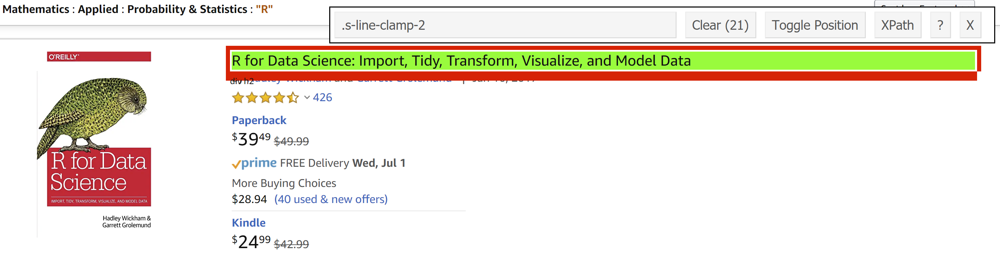
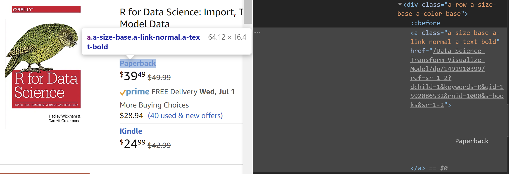
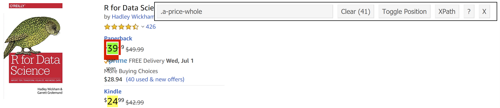
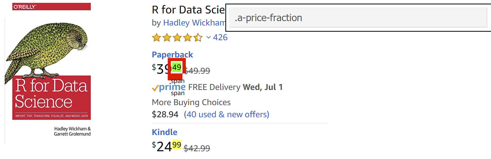
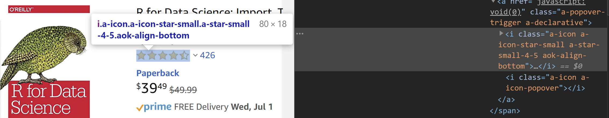
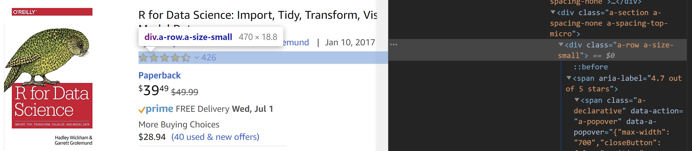
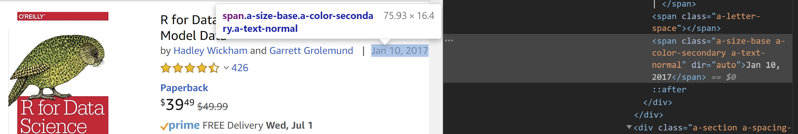

```{r setup, include=FALSE, echo = FALSE, message = FALSE, warning = FALSE}
knitr::opts_chunk$set(echo = TRUE, eval = FALSE, comment = "#>", collapse = TRUE)
library(robotstxt)
library(rvest)
library(tidyverse)
```


```{r save files, include=FALSE, echo = FALSE, message = FALSE, warning = FALSE, eval = FALSE}
# SAVE BACKUPS OF DATA FOR CONSISTENT KNITTING
write_xml(amazon, file="data/amazon.html")
write.table(format, "data/format.txt")
write.table(price, "data/price.txt")
write.table(price_fraction, "data/price_fraction.txt")
write.table(price_whole, "data/price_whole.txt")
write.table(pub_dt, "data/pub_dt.txt")
write.table(rate_n, "data/rate_n.txt")
write.table(rating, "data/rating.txt")
write.table(titles, "data/titles.txt")
saveRDS(r_books, "data/r_books.rds")
```


# About Me

<div style="float: left; width: 50%;">

</div>

<div style="float: left; width: 50%;">
- Dr. Matthew Hendrickson
- Social Scientist by Training
     - Psychology & Music `%>%`
     - Cognitive & Social Psychology `%>%`
     - Law & Policy
- Professional Experience (13+ years)
     - Higher Education Analyst
     - Independent Consultant
     - Research projects, data analysis, policy development, strategy, analytics pipeline solutions
</div>


# Topics

1. A Little About Web Scraping
2. Robots!
3. HTML & CSS
4. The Setup
5. Scraping the Data
6. Assembling the Data
7. References & Resources


# A Little About Web Scraping

"Web scraping is the process of automatically mining data or collecting information from the World Wide Web" <font size="2">-- Wikipedia</font>

<br>
Web scraping is a flexible method to extract numerical or textual data from the internet


## Use Cases

There are many uses for web scraping, including:

   1. Price monitoring
   2. Time series tracking & analysis
   3. Sentiment analysis
   4. Brand monitoring
   5. Market analysis
   6. Lead generation


# Robots!

- No, not those robots!
- _Always_ ensure __PRIOR to scraping__ that you have scraping rights!
- This is __critical__ as you can be blocked or even face legal action!


## Robots.txt

You can easily check with the `robotstxt` package

```{r robots, echo = TRUE, message = FALSE, warning = FALSE, eval = TRUE}
paths_allowed(paths = c("https://netflix.com/"))
```

Netflix does _not_ allow you to scrape their site


# HTML & CSS

<br>

_Hyper Text Markup Language_

"HTML is the standard markup language for creating Web pages"

<br>
<br>

_Cascading Style Sheets_

"CSS describes how HTML elements are to be displayed on screen, paper, or in other media"

<font size="2">-- W3Schools</font>


## HTML Structure


<font size="2">Image credit: [Professor Shawn Santo](http://www2.stat.duke.edu/~fl35/teaching/440-19F/decks/webscraping2.html#3)</font>


## HTML Tags

HTML is structured with "tags" indicating portions of a page

Tags can be called by their structure

Tags can be nested

A few important tags (of many) for scraping:

- `<h1>` header tags `</h1>`
- `<p>` paragraph elements `</p>`
- `<ul>` unordered bulleted list `</ul>`
- `<ol>` ordered list `</ol>`
- `<li>` individual list item `</li>`
- `<div>` division `</div>`
- `<table>` table `</table>`


## A Little Help with CSS
Extracting parts of a website can be daunting if unfamiliar with CSS


[SelectorGadget](https://selectorgadget.com/) is helpful (Chrome only)

Inspect the page elements is also helpful


## Scraping Methods

HTML - syntax is easier & aligns with HTML tags

XPATH - useful when the node isn't uniquely identified with CSS


# The Setup

```{r setup_slide, eval = FALSE}
library(robotstxt)
library(rvest)
library(tidyverse)
```

That's it!


## Determine a website to scrape

Seems appropriate to pull R book data from Amazon

```{r robots_amazon, echo = TRUE, message = FALSE, warning = FALSE, eval = TRUE}
paths_allowed(paths = c("https://amazon.com/"))
```

<br>
We are good to scrape!


# Specify the URL

```{r amazon_html, echo = TRUE, message = FALSE, warning = FALSE, eval = FALSE}
amazon <- read_html("https://www.amazon.com/s?k=R&i=stripbooks&rh=n%3A283155%2Cn%3A75%2Cn%3A13983&dc&qid=1592086532&rnid=1000&ref=sr_nr_n_1")
```

<font size="3">Data as of 2020-07-07</font>


```{r amazon_call, echo = FALSE, message = FALSE, warning = FALSE, eval = TRUE}
# Import the saved Amazon html for consistency in cleaning and presentation
amazon <- read_html("data/amazon.html")
```


# Titles




## Scraping book titles

```{r title, echo = TRUE, message = FALSE, warning = FALSE, eval = TRUE}
amazon %>% 
  html_nodes(".s-line-clamp-2") %>% 
  html_text() -> titles
head(titles)
```


## Removing `\n` & white space from the titles

```{r title_clean, echo = TRUE, message = FALSE, warning = FALSE, eval = TRUE}
titles <- str_trim(titles) # Removes leading & trailing space
head(titles)
```


# Formats




## Scraping the book format

```{r format, echo = TRUE, message = FALSE, warning = FALSE, eval = TRUE}
amazon %>% 
  html_nodes("a.a-size-base.a-link-normal.a-text-bold") %>% 
  html_text() -> format
head(format)
```


## Clean up book format values

```{r format_clean, echo = TRUE, message = FALSE, warning = FALSE, eval = TRUE}
format <- str_trim(format)
head(format)
```


# Price






## Scraping the book price

```{r price_whole, echo = TRUE, message = FALSE, warning = FALSE, eval = TRUE}
amazon %>% 
  html_nodes(".a-price-whole") %>% 
  html_text() -> price_whole
head(price_whole)
```


## Scraping (the rest of) the book price

```{r price_fraction, echo = TRUE, message = FALSE, warning = FALSE, eval = TRUE}
amazon %>% 
  html_nodes(".a-price-fraction") %>% 
  html_text() -> price_fraction
head(price_fraction)
```


## Combine price portions

```{r price_total, echo = TRUE, message = FALSE, warning = FALSE, eval = TRUE}
price <- paste(price_whole, price_fraction, sep = "")
head(price)
```


## Make it numeric

```{r price_total_numeric, echo = TRUE, message = FALSE, warning = FALSE, eval = TRUE}
price <- as.numeric(price)
head(price)
```


# Rating




## Scraping the book rating

```{r rate, echo = TRUE, message = FALSE, warning = FALSE, eval = TRUE}
amazon %>% 
  html_nodes("i.a-icon.a-icon-star-small.aok-align-bottom") %>% 
  html_text() -> rating
head(rating)
```


## Trim into a usable metric

```{r rate_trim, echo = TRUE, message = FALSE, warning = FALSE, eval = TRUE}
rating <- substr(rating, 1, 3)
head(rating)
```


## Make it numeric

```{r rate_trim_numeric, echo = TRUE, message = FALSE, warning = FALSE, eval = TRUE}
rating <- as.numeric(rating)
head(rating)
```


# Rating Counts




## Scraping the book rating count

```{r rate_n, echo = TRUE, message = FALSE, warning = FALSE, eval = TRUE}
amazon %>% 
  html_nodes("div.a-row.a-size-small") %>% 
  html_text() -> rate_n
head(rate_n)
```


## Trim the rating count

```{r rate_n_trim, echo = TRUE, message = FALSE, warning = FALSE, eval = TRUE}
rate_n <- str_trim(rate_n)
head(rate_n)
```


## Rating count - substring

```{r rate_n_substring, echo = TRUE, message = FALSE, warning = FALSE, eval = TRUE}
rate_n <- str_sub(rate_n, -5)
head(rate_n)
```


## Trim the rating count (again)

```{r rate_n_trim_2, echo = TRUE, message = FALSE, warning = FALSE, eval = TRUE}
rate_n <- str_trim(rate_n)
head(rate_n)
```


## Set as numeric

```{r rate_n_numeric, echo = TRUE, message = FALSE, warning = FALSE, eval = TRUE}
rate_n <- as.numeric(rate_n)
head(rate_n)
```


# Publication Date




## Scraping the book publication date

```{r pub_dt, echo = TRUE, message = FALSE, warning = FALSE, eval = TRUE}
amazon %>% 
  html_nodes("span.a-size-base.a-color-secondary.a-text-normal") %>% 
  html_text() -> pub_dt
head(pub_dt)
```


## Convert to a date

```{r pub_dt_clean, echo = TRUE, message = FALSE, warning = FALSE, eval = TRUE}
pub_dt <- as.Date(pub_dt, "%b %d, %Y")
head(pub_dt)
```


# We Have the Pieces

Let's assemble the file!

1. Titles
2. Formats
3. Prices
4. Ratings
5. Rating Counts
6. Publication Date


## Check the scrapes

```{r uneven_counts, echo = TRUE, message = FALSE, warning = FALSE, eval = TRUE}
length(titles)
length(format)
length(price)
length(rating)
length(rate_n)
length(pub_dt)
```

_Wait! What?!?_


## What Happened?

Sometimes you get an uneven number of records in the scrape

We can fix this!

<br>
_...manually..._


# Fixing the Scrapes


# Fixing Titles

Titles scraped accurately, but have multiple formats

```{r title_missing, echo = TRUE, message = FALSE, warning = FALSE, eval = TRUE}
titles %>% 
  rep(, each = 2) -> titles
length(titles)
```


## Fixing Titles

Some books have 3 formats

```{r title_missing_3, echo = TRUE, message = FALSE, warning = FALSE, eval = TRUE}
titles %>% 
  append(values = titles[15], after = 15) %>% 
  append(values = titles[11], after = 11) %>% 
  append(values = titles[9], after = 9) %>% 
  append(values = titles[5], after = 5) -> titles
length(titles)
```


# Fixing Formats

Nothing needed here!

```{r format_missing, echo = TRUE, message = FALSE, warning = FALSE, eval = TRUE}
length(format)
```


# Fixing Prices

Or here!

```{r price_missing, echo = TRUE, message = FALSE, warning = FALSE, eval = TRUE}
length(price)
```


# Fixing Ratings

Books missing ratings

```{r rate_missing, echo = TRUE, message = FALSE, warning = FALSE, eval = TRUE}
rating %>% 
  append(values = NA, after = 7) %>% 
  append(values = NA, after = 11) -> rating
length(rating)
```


## Fixing Ratings

Multiple formats - repeat ratings

```{r rate_missing_2, echo = TRUE, message = FALSE, warning = FALSE, eval = TRUE}
rating %>% 
  rep(, each = 2) -> rating
length(rating)
```


## Fixing Ratings

Books with 3 formats

```{r rate_missing_3, echo = TRUE, message = FALSE, warning = FALSE, eval = TRUE}
rating %>% 
  append(values = rating[15], after = 15) %>% 
  append(values = rating[11], after = 11) %>% 
  append(values = rating[9], after = 9) %>% 
  append(values = rating[5], after = 5) -> rating
length(rating)
```


# Fixing Rating Counts

Books missing ratings & rating counts

```{r rate_n_missing, echo = TRUE, message = FALSE, warning = FALSE, eval = TRUE}
rate_n %>% 
  append(values = NA, after = 7) %>% 
  append(values = NA, after = 11) -> rate_n
length(rate_n)
```


## Fixing Rating Counts

Multiple formats - repeat rating counts

```{r rate_n_missing_2, echo = TRUE, message = FALSE, warning = FALSE, eval = TRUE}
rate_n %>% 
  rep(, each = 2) -> rate_n
length(rate_n)
```


## Fixing Rating Counts

Books with 3 formats

```{r rate_n_missing_3, echo = TRUE, message = FALSE, warning = FALSE, eval = TRUE}
rate_n %>% 
  append(values = rate_n[15], after = 15) %>% 
  append(values = rate_n[11], after = 11) %>% 
  append(values = rate_n[9], after = 9) %>% 
  append(values = rate_n[5], after = 5) -> rate_n
length(rate_n)
```


# Fixing Publication Date

Multiple formats - repeat publication dates

```{r pub_dt_missing, echo = TRUE, message = FALSE, warning = FALSE, eval = TRUE}
pub_dt %>% 
  rep(, each = 2) -> pub_dt
length(pub_dt)
```


## Fixing Publication Date

Books with 3 formats

```{r pub_dt_missing_3, echo = TRUE, message = FALSE, warning = FALSE, eval = TRUE}
pub_dt %>% 
  append(values = pub_dt[15], after = 15) %>% 
  append(values = pub_dt[11], after = 11) %>% 
  append(values = pub_dt[9], after = 9) %>% 
  append(values = pub_dt[5], after = 5) -> pub_dt
length(pub_dt)
```


# One Last Check!

```{r even_counts, echo = TRUE, message = FALSE, warning = FALSE, eval = TRUE}
length(titles)
length(format)
length(price)
length(rating)
length(rate_n)
length(pub_dt)
```


# (Finally) Assemble the Data

```{r final, echo = TRUE, message = FALSE, warning = FALSE, eval = TRUE}
r_books <- tibble(title            = titles,
                  text_format      = format,
                  price            = price,
                  rating           = rating,
                  num_ratings      = rate_n,
                  publication_date = pub_dt)
head(r_books)
```


# References & Resources

- Bauer V (2016). "Introduction to Web Scraping in R: Very Applied Methods Workgoup." [https://stanford.edu/~vbauer/files/teaching/VAMScrapingSlides.html](https://stanford.edu/~vbauer/files/teaching/VAMScrapingSlides.html).
- University of Cincinnati (2018). "UC Business Analytics R Programming Guide." Specifically the portion of scraping. [https://uc-r.github.io/](https://uc-r.github.io/).
- Dataquest (no date). "Tutorial: Web Scraping in R with rvest." [https://www.dataquest.io/blog/web-scraping-in-r-rvest/](https://www.dataquest.io/blog/web-scraping-in-r-rvest/).
- Im J (2019). "Web Scraping Product Data in R with rvest and purrr." [https://www.business-science.io/code-tools/2019/10/07/rvest-web-scraping.html](https://www.business-science.io/code-tools/2019/10/07/rvest-web-scraping.html).
- Kaushik S (2017). "Beginner's Guide on Web Scraping in R (using rvest) with hands-on example." [https://www.analyticsvidhya.com/blog/2017/03/beginners-guide-on-web-scraping-in-r-using-rvest-with-hands-on-knowledge/](https://www.analyticsvidhya.com/blog/2017/03/beginners-guide-on-web-scraping-in-r-using-rvest-with-hands-on-knowledge/).


## References & Resources continued

- Perceptive Analytics on KDnuggets (2018). "A Primer on Web Scraping in R." [https://www.kdnuggets.com/2018/01/primer-web-scraping-r.html](https://www.kdnuggets.com/2018/01/primer-web-scraping-r.html).
- Rsquared Academy (2019). "Practical Introduction to Web Scraping in R." [https://blog.rsquaredacademy.com/web-scraping/](https://blog.rsquaredacademy.com/web-scraping/).
- W3Schools (no date). "CSS Introduction." [https://www.w3schools.com/css/css_intro.asp](https://www.w3schools.com/css/css_intro.asp).
- W3Schools (no date). "HTML Introduction." [https://www.w3schools.com/html/html_intro.asp](https://www.w3schools.com/html/html_intro.asp).
- W3Schools (no date). "XPath Syntax." [https://www.w3schools.com/xml/xpath_syntax.asp](https://www.w3schools.com/xml/xpath_syntax.asp).
- Wikipedia (2020). "Web scraping." [https://en.wikipedia.org/wiki/Web_scraping](https://en.wikipedia.org/wiki/Web_scraping).


# Thank you
  
[\@mjhendrickson](https://twitter.com/mjhendrickson)

  
[matthewjhendrickson](https://www.linkedin.com/in/matthewjhendrickson/)

  
[mjhendrickson](https://github.com/mjhendrickson)

<br>

[Web Scraping in R & rvest on GitHub](https://github.com/mjhendrickson/Web-Scraping-with-R)

This talk is freely distributed under the MIT License.